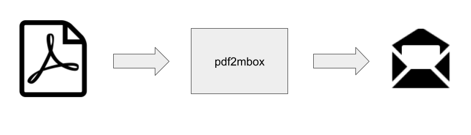

*Note:* pdf2mbox is in a pre-release stage of development. You can monitor progress by watching [the repo](https://github.com/history-lab/pdf2mbox).

## motivation
Archivists and others involved in creating email archives for historical and research purposes are the intended users of pdf2mbox. 

Many emails released under Freedom of Information Act (FOIA) requests are in PDF format with a single PDF often containing hundreds of emails. Email archiving systems for historical research and preservation, such as [ePADD](https://epadd.stanford.edu/) and [DArcMail](https://siarchives.si.edu/what-we-do/digital-curation/email-preservation-darcmail), are natural destinations for such FOIAed emails. However, these systems don't currently accept PDFs as input, but they take MBOX as input. By using pdf2mbox as a pre-processing step, users will be able to archive PDF emails in these systems.

Information is lost when exporting an email in PDF format from an email system. However, in most cases, we believe enough information is retained in an email PDF to create a proxy of the original email acceptable for use by historians and other researchers.

## usage
pdf2mbox is open source and distributed under the MIT license. Developed in Python, pdf2mbox will be available as a PyPI package and installable via `pip install pdf2mbox`. Here is how to run pdf2mbox as a command-line utility: 
```
% python pdf2mbox.py -h
usage: pdf2mbox.py [-h] [--version] pdf_file mbox_file

Generates an MBOX from a PDF containing emails

positional arguments:
  pdf_file    PDF file provided as input
  mbox_file   Mbox file generated as output

optional arguments:
  -h, --help  show this help message and exit
  --version   show program's version number and exit
```
  
## use cases

##### single PDF containing single email
A user has a PDF file named `email.pdf` containing a single email. To convert the email to MBOX format, the user would run the following command in the directory containing the PDF:
```
python pdf2mbox.py email.pdf out.mbox
```
If the file `out.mbox` already exists, the PDF email will be converted and appended to it. If `out.mbox` does not exist, pdf2mbox creates it.

##### single PDF containing multiple emails
This use case is very similar to the **single PDF containing single email** case. The user will enter the same command, and every email in the PDF is converted and appended to the MBOX file.

##### multiple PDFs
A user has multiple email PDF files in the same directory. The user can construct a simple bash for loop to process all the PDFs:

```
for f in *.pdf
do
  python pdf2mbox.py $f mbox.out
done
```

##### do you have an additional use case for pdf2mbox or a requirement you'd like it to support? 
We want to hear about it, so please raise it as an [issue](https://github.com/history-lab/pdf2mbox/issues).

## about us
Columbia University's [History Lab](http://history-lab.org) is developing pdf2mbox as part of its **Creating Email Archives from PDFs: The Covid-19 Corpus** project.  The project will also create an extensive collection of FOIAed emails on the initial governmental and public health response to the Covid-19 pandemic in the United States. This email collection will be made accessible via: 
- a website interface with search and analytical tools
- an application programming interface (API)
- Columbia University Libraries' Government Information Portal

The project is funded in part by The Mellon Foundation's "Email Archives: Building Capacity and Community" program.

